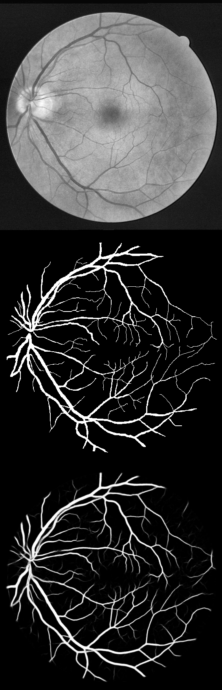
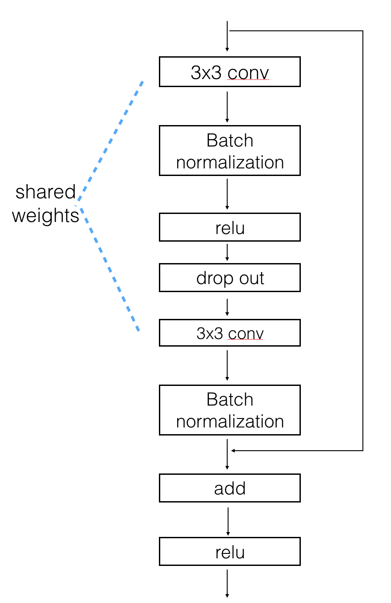

# LadderNet
* This is repository for my paper [LadderNet: Multi-path networks based on U-Net for medical image segmentation](https://arxiv.org/abs/1810.07810).  
* This implementation is based on [orobix implementation](https://github.com/orobix/retina-unet). Main difference is the structure of the model.

# Requirement
* Python3 
* PyTorch 0.4
* configparser

# How to run
* run <b>"python prepare_datasets_DRIVE.py"</b> to generate hdf5 file of training data
* run <b>"cd src"</b>
* run <b>"python retinaNN_training.py"</b> to train
* run <b>"python retinaNN_predict.py"</b> to test

# Parameter defination
* parameters (path, patch size, et al.) are defined in <b>"configuration.txt"</b>
* training parameters are defined in src/retinaNN_training.py line 49 t 84 with notes <b>"=====Define parameters here =========" </b>

# Pretrained weights
* pretrained weights are stored in <b>"src/checkpoint"</b>
* results are stored in <b>"test/"</b>

# Results
The following table compares this method to other recent techniques, which have published their performance in terms of Area Under the ROC curve (AUC ROC) on the DRIVE dataset.

| Method                  | AUC ROC on DRIVE |
| ----------------------- |:----------------:|
| Soares et al [1]        | .9614            |
| Azzopardi et al. [2]    | .9614            |
| Osareh et al  [3]       | .9650            |
| Roychowdhury et al. [4] | .9670            |
| Fraz et al.  [5]        | .9747            |
| Qiaoliang et al. [6]    | .9738            |
| Melinscak et al. [7]    | .9749            |
| Liskowski et al.^ [8]   | .9790            |
| orobix                  | .9790            |
| **this method**         | **.9794**        |

# Method
* Laddernet can be viewed as a chain of two U-Nets to generate multiple paths of FCN for information flow.

* use shared weights between two conv layers within a residual block.

